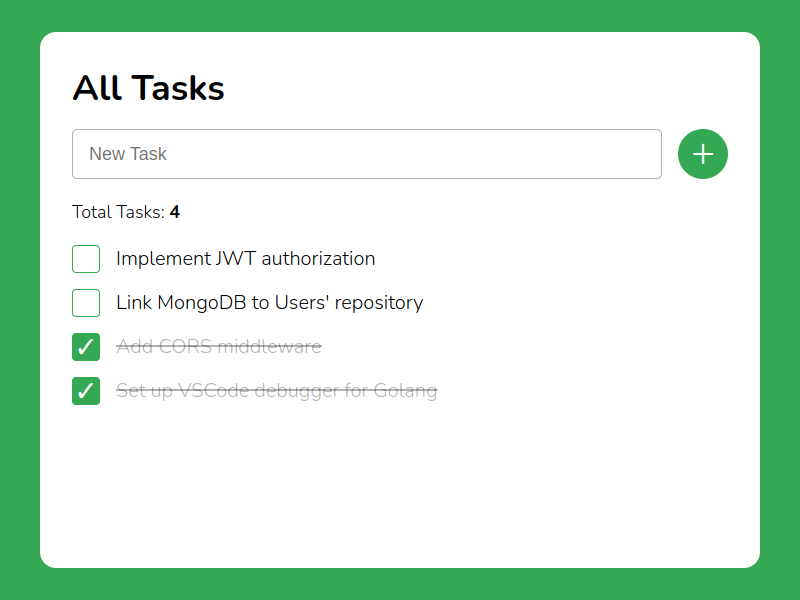

# ToDo

**ToDo** - это браузерный менеджер задач для ведения небольшого списка дел.

Возможности:

- добавление задачи;
- изменение статуса существующей задачи: выполнено / не выполнено;
- удаление существующей задачи;
- удаление всех задач из списка.

Задачи всегда сохраняются в локальное хранилище браузера. Нельзя добавить задачу с существующим текстом. Добавить задачу можно, нажав клавишу `Enter`. Чтобы очистить список задач нужно нажать комбинацию клавиш `Shift` + `Delete`.

\
*Веб-интерфейс ToDo*

## Запуск

Перетащите мышкой файл index.html в окно браузера.
