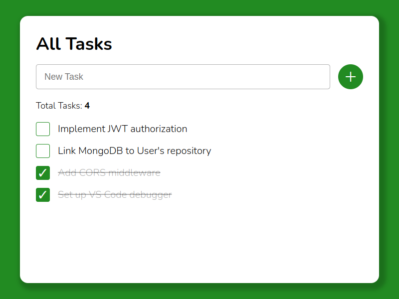

# ToDo

**ToDo** - это браузерный список дел для управления задачами.

Возможности:

- добавление задачи (помещение введенного текста задачи в список);
- изменение статуса задачи: **не выполнено** (текст задачи без декорации) / **выполнено** (декорация текста задачи - зачеркнутый текст);
- удаление существующей задачи (удаление задачи из списка).

Задачи невозможно дублировать (произойдет уведомление функцией `alarm`).

\
*Веб-интерфейс ToDo*

## TODO (что необходимо сделать)

* Добавить в проект бэкенд-сервис, сохраняющий дела на диске и возвращающий список всех дел по запросу. Написать данный сервис на языке Golang.
* Реализовать на бэкенде сохранение дел из списка в одну из СУБД: MySQL, PostgreSQL, MongoDB.
* (Доп.) Добавить развертывание с Docker.

## Запуск

Перетащите мышкой файл index.html в окно веб-браузера.
